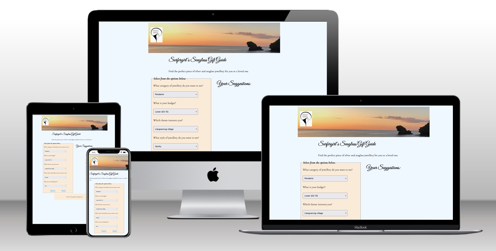

# Surfergirl's Seaglass Gift Guide

By Kat Dawes

---

---

This is the documentation for my web application **Surfergirl's Seaglass Jewellery Gift Guide**.
The deployed application can be found here: https://surfergrl.github.io/sgs-gift-guide/

Please note that this application is designed to appear on the surfergrl.co.uk site; it is not yet living in its final destination. See the Deployment section for more details.

The Gift Guide application has been built using HTML5, CSS3 & JavaScript and is my second project for Code Institute’s Diploma in Web Application Development.

## Table of Contents

- [Project Development & Planning](#project-development--planning)
  - [Background](#background)
  - [Project Goals](#project-goals)
  - [User Stories](#user-stories)
  - [Market Review](#market-review)
- [Scope and Structure](#scope--structure-of-the-site)
  - [Scope](#scope)
  - [Structure](#navigation-and-layout--structure)
  - [JavaScript functionality](#javascript)
  - [Future developments](#future-developments)
- [Wireframes – Skeleton](#wireframes-skeleton-plane)
- [Design & Layout](#design-layout-colours)
  - [Colours and fonts](#colours)
- [Technologies Used](#technologies-used)
- [Validation & Testing](#validation-and-testing)
- [Deployment](#deployment)
- [Credits](#credits)
- [Thanks](#thanks-to)

#### Technologies Used

- [HTML](https://en.wikipedia.org/wiki/HTML5)
- [CSS3](https://en.wikipedia.org/wiki/Cascading_Style_Sheets)
- [JavaScript](https://en.wikipedia.org/wiki/JavaScript)
- [WordPress](https://www.google.com/url?sa=t&rct=j&q=&esrc=s&source=web&cd=&cad=rja&uact=8&ved=2ahUKEwi-t4XAqtyAAxUxXEEAHbhkBBQQFnoECBwQAQ&url=https%3A%2F%2Fen-gb.wordpress.org%2F&usg=AOvVaw3_Yh8Jp55SAR0s1nidR2lh&opi=89978449)

---

## Project Development and Planning

### Background

The Surfergirl's Seaglass website sells silver and seaglass jewellery. It is built with WordPress and WooCommerce.

The purpose of the Gift Guide application is to provide a quiz-type interface to guide the customer to choosing the perfect piece of jewellery.

### Project Goals

- External user's goal: To gather suggestions for jewellery for themselves or a gift for someone else.

- Site owner's goals:
  - To capture the buyer who is not sure what they want
  - To showcase products and entice buyers to purchase with confidence
  - Have potential customers become familiar with the products on offer
  - Provide a fun way of browsing through items
  - To show that the brand is a polished, quality, reliable entity
  - Increase revenue

---

### User Stories

The user stories are based on previous market research in the field – meeting customers at local stockists and craft markets, and contact via email/social media accounts of the business.

#### Customer profiles:

- Spouse/partner with no idea what their partner would like
- Previous visitor to shop or online presence, now at the website and curious
- Bride searching for bridesmaid gifts
- Christmas shopper in a hurry with limited idea of what someone might want
- Undecided purchaser who has seen items but isn't sure what they want

#### Customer goals:

- Be led to suitable product/s for the giftee (or themselves)
- Select according to their budget
- Get a better idea of what the brand is about
- Be confident that they have selected something suitable
- Be able to backtrack if they want to see something else
- Achieve their goal quickly and easily if required
- Browse products in a unique, interesting way
- Be confident that the website is genuine and sells quality products
- Be able to see more details then buy quickly and easily

---

## Research

### Market Review

I looked at various jewellery sites to see how they use interactivity to encourage browers to buy. I was interested in how the options were presented, the user journey through them and the choices available to save/download/share results. I looked at the overall design in terms of ease of use and attractiveness.

Pandora

Has [The Perfect Gift Finder](https://uk.pandora.net/en/gifts/featured-gifting/the-perfect-gift-finder-landing/#navigation) which looks to be an interactive tool, but at the time of testing it did not work.

It also has [GiftMe - Customised by Me](https://uk.pandora.net/en/discover/stories/pandora-me-for-every-me/build-me/?useParentCtaStyle=true&defaultButtonStyle=ci-button-text-black-pink-underlined&customClass=ci-m52-explore-module-btn&customSize=small&trackingData=icid=e:pme:plp:explore:BUILDME&parentCtaStyle=ci-button-filled-white#icid=e:pme:plp:explore:BUILDME) which allows customer to build the ideal gift for a BFF. I found this had very limited functionality; a user chooses from earrings/bracelets/rings and it takes you to the section on the page where they are. I planned something much more interactive and personalised.

Cartier

Offers a [Gifts](https://www.cartier.com/en-gb/collections/gifts) page with links to category pages:

- The Most Iconic Cartier Gifts
- Gifts for Her, Gifts for Him
- Little Luxuries
- Pesonalised

As an immeditely recognisable luxury brand, they provide easy ways to get to the most iconic items such as the Love bracelet and the bestselling fragrance set.

I liked the idea of offering a cheaper option (here £100+) as well as the main items (£7,000 bracelets etc.) and have used this in my design.

Clogau Gold

Clogau Gold is made with rare Welsh gold and is the choice for royal wedding rings.The [Compose](https://www.clogau.co.uk/pages/compose) page allows a prospective bride/groom to move through various options to build their perfect ring.

_Notes:_

- Classy interface
- Choose your metal, style, diamond clarity, diamond size, ring size.
- Provides a code to save.
- Option to be reminded later (a simple contact web form).
- Option to view the finished design.
- No way to move backwards through the choices.

Tiffany

https://www.tiffany.co.uk/gifts/shop/gifts-for-her/

Doesn't offer anything interactive.
Offers categories to explore such as those shown above in the 'Gifts for Her' section.

Thomas Sabo

https://www.thomassabo.com/GB/en_GB/charms-creator

**Charm Club**

- Attractive interface
- Clear about its purpose
- Choose a Style
- Choose a length
- Option to zoom in and out on images
- 'Try your luck' button chooses six random charms to start the user off
- Option to share/download creation
- Choose charms - includes filter options:

(Target group = choice of For Him or For Her.)

I particularly liked the insertion of a random product or two to showcase something the user might not have considered looking at on their own.

### Market research general notes:

- Gift Guides were often just pages of products in no particular order
- Often little or no guidance to help customers
- Luxury brands often used video
- Multiple pictures were used to convey attractive aspects of the products
- Those that offered choices had about 3 or 4 questions before presenting options.
- Thomas Sabo and Pandora Me both offered visually appealing landing pages with a title, subtitle and a couple of lines to entice a user in.

In conclusion, I could not find a jewellery website which did what I planned to do, but there are some elements that I was able to use to plan my functionality.

_Specifically, I wanted:_

- Attractive interface and landing page to entice users (title, subtitle, image, explanation of purpose)
- Clear purpose to the tool
- Four or five questions - ease of use, speed
- Options to save/download/share - these have not been implemented and are for future development
- Ability to move backwards and forwards to change choices - reset the form and try again

I also looked at interactive gift guides for other products: https://blog.dot.vu/holiday-gift-guide-examples/
'A digital tool that guides your audience toward the products that would make a perfect gift will increase orders.'

---

## Current Website

The site for Surfergirl's Seaglass already exists at [www.surfergrl.co.uk](http://www.surfergrl.co.uk) and sells silver and seaglass jewellery on the themes of the ocean and seashore. (Seaglass is pieces of glass tumbled smooth and opaque by the ocean.) The site is built on WordPress with WooCommerce.

The site is basic includes:

- About information - brand story
- A personal blog on aspects of jewellery, surfing, ocean-side living, beauty and more.
- Contact page - social media links and email address
- Shop page - categories, featured products, image gallery, basic Ts&Cs
- Item pages - images, price, description, Add to Cart button, reviews section

The shop offers products in broad categories - bracelets, earrings, necklaces/pendants, rings, keyrings and anklets. A customer who comes to the site with little or no knowledge of the brand might struggle to choose something, particularly if they are looking for a gift. The gift guide aims to present compelling options to suit a wide range of customers.

---

### Desired Features - rated 1-5 in order of importance

- Move through a short series of questions about preferences, based on the jewellery available on the site. 1
- Provide a range of options - category, style, budget, gender and theme. 1
- Allow the user to move back and change the answer to a question, then carry on. 2
- Allow the user to start over at any point. 3
- Option to skip a question if you don't know e.g. ring size. 2
- Provide results in a manner that is visually appealing and user friendly. 1
- Results can be instantly added to the basket. 3
- Option provided to request more information or bespoke pieces. 2

---

### Further Developments

- Options for how to size a ring or what length of necklace do I want. 4
- Results can be emailed/downloaded/saved to a wish list. 4
- Although the app will present an ideal option, I don't want this to stop people seeing other items, so I could add an 'other ideas' section below the main result with some add-on options or alternatives. 4
- I would like to design a similar tool in the future to allow people to cchoose their options for personalised items e.g. stamped inscriptions, engraving and specific charms and colours of seaglass. For now if they end up with this option, it will send them to a contact form on the site so they can enquire personally. 5
- A 'customers also bought' strip below the guide's results, with some more ideas. 5
- 'Not sure' option, e.g. if the user doesn't know what style a giftee might prefer. The app will then in this case present an option from any of the styles. 2

These options need to conform to the principles of UX in all five different planes.

---

## Design, layout, colours

### Content - elements to include

**Headline** - Surfergirl's Seaglass Gift Guide

**Tag-line** - This is a short explanation of what the app does: 'Find the perfect piece of silver and seaglass jewellery for you or a loved one.'

**Categories**

to match the products on the SGS site.

Categories:

- Bracelets
- Rings
- Keyrings
- Pendants
- Anklets

---

### Wireframes

I first sketched (on paper) the basic layout for the HTML page with landing page, questions page and results page. In the end I decided to have these all on one pages and use divs to show the relevant part of the guide.

Keeping the design clean and simple was a priority both for UX and responsiveness.

- insert scans of drawings

### Structure

The app is contained on one page.

#### Basic code structure

    Data Definition: Defined an array of jewellery items with various properties.

    Form Submission Handling: Set up an event listener for the form with the ID 'questionForm' to handle form submissions. This listener captures form data and calls the filterItems function.

    Filtering Function: The filterItems function filters the items based on the form data and returns the filtered items as an array. The function returns 'filtered' and logs it to the console.

    Result Display: Creates an ul element and added list items to it based on the filtered items. The resulting list is appended to the 'resultsElement' in HTML.

    DOMContentLoaded Event: Ensures that the code only runs after the page has fully loaded.

---

#### Welcome

Landing page with title, image and tagline.

Background image: 

Logo

---

#### Questions - Five questions with between 3-5 options each.

Questions - Five questions with between 3-5 options each.

Submit button
Reset button

The quiz will consist of five questions with several answer options based on available products:

1. What type of jewellery does this person wear? Bracelets, rings, anklets, keyrings, necklaces, earrings.
2. What is the budget? Lower £5-20 Medium £20-35 Higher £35+
3. What theme appeals? - Llangrannog/Wales, Cariad/Love, waves, seaglass
4. What style might appeal to them? Quirky, classic, delicate, chunky
5. His, hers or both?

Note that size is not relevant here as most products are one-size or adjustable. Items which need sizing will show options on the main item page. To avoid complicating the tool asking for sizes, I will let the main pages take care of this aspect.

---

#### Results:

Products matching user preferences are shown with a name, image, prices, 'add to cart' button and 'more info' link (which goes to the main item page with more photos etc.).

#### Results Options:

Standard products - many of the items on the SGS store are one-off pieces due to the unique nature of seaglass. I have therefore chosen to only present established pieces from the main collections in the results.

_Pendants:_

- Carreg Bica pendant $$$ £30
- Anchor and seaglass pendant $$ £25
- Wire-wrapped seafoam pendant $$ £20-25
- Simple green bail pendant $$ £2-25
- Cariad bar $$$ £45
- Half & Half necklace $$$ £35?

_Bracelets:_

- Cariad bracelet $$$ £45
- Silver-plated Charm bracelet with seashore charms (contact for bespoke) $ £15
- Silver Charm bracelet $$ £25
- Silver tone seashore charms bracelet £10 $
- Cuff copper Carreg Bica coordinates (bespoke option) $ £10

_Earrings:_

- Threader $$ £15
- Wire-wrapped seaglass drops $ £15
- Spiral hoops $ £15

_Rings:_

- Wrap silver $$
- Cuff silver Cariad $$
- Aluminium stamped with waves £ £5-7
- Silver wave ring $ £20

_Anklets:_

- Silver charm $$ £20
- Silver tone bead charm $ £10

_Keyrings:_

- Mermaid $ £6.50
- 'Shell in your pocket' slogan $ £6.50

_For each result:_

- Product suggestions
- Price
- Picture
- Short description
- Link to main item page
- Add to Cart button - an option to quickly add to cart without seeing full item info page e.g.:

- Share/save button
- Reset button to reset all choices to default

- 404 error page

---

### Colours - Surface plane

The Surfergirl's Seaglass brand uses ocean-themed colours - whites, blues, greens plus sunset and sandy colours feature heavily. The app will reflect this.

Colours needed for:

- Titles
- subtitles
- Body text - black
- Backgrounds

Colours needed for gift guide specifically: same colours but add in some contrasting and highlighting.

---

### Fonts

#### Legibility, accessibility, contrast

I wanted to ensure readability and consistency throughout the app, maintaining a balance between style and readability. I also wanted to ensure that the fonts complement the beach theme of the main site effectively.

- GoogleFonts
- FontAwesome?
- [ezGIF](https://ezgif.com/) - Creating GIFs for the README
- [Techsini Mockup](https://techsini.com/multi-mockup/) - Creating the mockup images for the README
- [Favicon.io](https://favicon.io/favicon-converter/) - Used to create and add the favicon to the browser tab

Colour palettes from [canva.com/colours](http://canva.com/colours)

1. [Six Hands Rough](https://www.onlinewebfonts.com/download/f6db36f5c636e2adf912702a4ad751ec) font for headings

2. **Roboto Slab:** To provide a contrast to the script font and give a modern and lcean look, I'll use this for subheadings.

3. **Montserrat:** Montserrat is clean and easy to read. I will use this for body text e.g. product description.

4. **Dancing Script:** Dancing Script is another script font, but it's a bit more formal than Pacifico. It can work well for adding an elegant touch to your beach-themed site.

5. **Nunito:** Nunito is a rounded sans-serif font that can be a good choice for body text. It's friendly and easy on the eyes.

6. **Playfair Display:** If you want to add a touch of sophistication to your headings, Playfair Display is an elegant serif font that can work well in combination with script or sans-serif fonts.

---

# Bugs and issues

### Product combinations

The main issue with the application itself is that if there is no product available for the combination chosen, a 'catch-all' product appears. This means the results section is never empty, but also means that the user will be presented with a product that does not match the selections they made on the form.

With all the options available, there are over 500 possible combinations a user could pick. These cannot be coded in by hand. They would also require a lot more products to be available. This would be best done by linking to the full product catalogue in the WordPress/WooCommerce site which hosts the products. If there is no, or only one, suitable product, another 'bestseller' according to the database could be inserted. Linking to and querying this database is beyond the scope of this project.

### Clearing the form and results area

When the Submit button is clicked, the innerHTML for the results area loses its heading. The Reset button preserves the heading, but once Submit has been clicked, it's gone until there is a page refresh. I would look at this with more time.

### Updating products

Because the product details are in a static array, they would be hard to update, especially for someone working on the site who cannot amend JavaScript with confidence. Again, the product list should be drawn from the WooCommerce products in the main site. For now, the application is not as flexible as it could be – this would be a great next step.

---

## Deployment

The application is currently deployed at https://surfergrl.github.io/sgs-gift-guide/

The gift guide will eventually be live on the [Surfergrl.co.uk](http://surfergrl.co.uk) website

Within the main site I looked at presenting the Guide

- On a whole new page within an iFrame
- As a pop-up overlaid onto the shop Home page.
- As a pop-up available from any page.

I wanted deployment to be

- Easy for me
- Easily accessible for the user
- Easy to update when necessary
- Fitted in with WordPress without too much extra code or workarounds which might compromise UX

This work was beyond the scope of the current project, and will be implemented as a next stage.

This means that the gift guide's links to products take you out of the Guide itself at present, and into the main site. You can return to the Guide tab as the links all open in a new tab. The idea is to have the Guide embedded in the website so links will go to products within the same window, but you can still get back to your results easily.

---

## Credits

[Top](#table-of-contents)

CSS Scan for stylised buttons
GoogleFonts

## Thanks to

Mentor Richard Wells

CI tutors Oisin and Gemma

---
