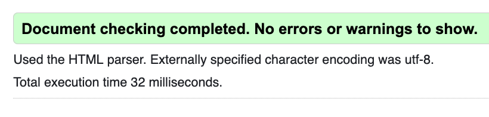

# Validation and Testing

https://surfergrl.github.io/sgs-gift-guide/

Testing was conducted on the above page.

The guide is also functional at [Surfergrl.co.uk](https://surfergrl.co.uk/gift-guide); the code is the same.

## HTML run through W3C validator Errors on index.html:

- A rogue link in the meta tags was removed.
- Trailing slashes in void tags were being added by Prettier. This threw an 'info' in the validator: 'Trailing slash on void elements has no effect and interacts badly with unquoted attribute values'. I attempted configuring Prettier to stop this but was not successful as this affects other files badly e.g. Markdown files. It is a known issue with Prettier.

Validates with no warnings.

## CSS run through Jigsaw

Valid CSS

  

These warnings refer to external vendor CSS which is not in my control.
The CSS still validates.

## JavaScript

The javascript passes through https://jshint.com/ with no major issues.
There are warnings about using 'const' and arrow functions as they are more modern syntax but I am happy with that.

## Wave Accessibility Tool

- Select elements in my form did not have labels. Fixed.
- Low contrast on Submit and Reset buttons. Fixed by increasing font weight and darkening colour.
- Warning of a skipped header level. Only heading in the Footer is a H4; left as is.
- Alert for no page regions. There is header,footer and fieldset. The app is designed to run inside another page with all of this information so this works as expected here.

## Tested on

- Chrome Version 131.0.6778.265 renders as expected
- Firefox 134.0.1 renders as expected
- Safari 17.6 renders as expected
- Microsoft Edge renders as expected
- Internet Explorer via Edge IE mode poor (as expected)

Works as expected on:

- MacBook Air 13"
- MacBook Pro 16"
- iPhone ProMax 12, Google and Safari
- iPhone 14

I used Firefox's DevTools to check the appearance of the page for screen sizes 320px and above, and the media queries work as expected to create the intended layout.

### Lighthouse

I tested the app using Lighthouse from the Chrome Developer Tools panel.

- I was happy with the results, but would like to optimise some of my image sizes to improve load time.
- The header and logo took the most time to load.
- In the final deployment, the header and logo are taken care of by the WordPress page which hosts the application, so I am not too worried about this.

---

### Screenshots

#### Minimum screen width tested for was 320px; the app works as expected.

#### Showing the app on screens over 800px wide.

#### Tested using DevTools for big screens; content stays centered as required.

### Testing against user stories

#### Site owner's goals:

- To capture the buyer who is not sure what they want
- To showcase products and entice buyers to purchase with confidence
- Have potential customers become familiar with the products on offer
- Provide a fun way of browsing through items
- To show that the brand is a polished, quality, reliable entity
- Increase revenue

| **Goal**                         | **Feature**                     | **Expected Result**               | **Actual Result**                                    |
| -------------------------------- | ------------------------------- | --------------------------------- | ---------------------------------------------------- |
| Capture buyers                   | Attractive design               | View products with photos         | Works as expected                                    |
| Showcase products                | Results area                    | Results shows at least 2 products | Works as expected; more products needed              |
| Customers learn more about brand | Results shows products          | Shows products                    | Works but customer must view main site for full info |
| Fun                              | Interactive quiz                | Easy to see results               | As expected                                          |
| Confidence in brand              | Direction to main site          | Use full features of main site    | As expected                                          |
| Increase revenue ££              | Results area showcases products | More products sold                | To be seen!                                          |

#### Customer goals:

- Be led to suitable product/s for the giftee (or themselves)
- Select according to their budget
- Get a better idea of what the brand is about
- Be confident that they have selected something suitable
- Be able to backtrack if they want to see something else
- Achieve their goal quickly and easily if required
- Browse products in a unique, interesting way
- Be confident that the website is genuine and sells quality products
- Be able to see more details then buy quickly and easily

| **Goal**                      | **Feature**                   | **Expected Result**            | **Actual Result**                                    |
| ----------------------------- | ----------------------------- | ------------------------------ | ---------------------------------------------------- |
| Find suitable gift            | 5 questions                   | See products                   | Works as expected                                    |
| Narrow by budget              | One question to define budget | Narrow down results            | Works as expected; more products needed              |
| Try again for new suggestions | Click Reset                   | Clears the form                | Works as expected                                    |
| See more information and buy  | Click See More                | Product page opens in new tab  | Customer can buy                                     |
| Buy immediately               | Add to Cart button            | Not yet implemented            | Customer must view full product page                 |
| Learn more about brand        | Results shows products        | Shows products                 | Works but customer must view main site for full info |
| Achieve goal quickly          | Short clear form              | Two products shown at least    | As expected                                          |
| Confidence                    | Direction to main site        | Use full features of main site | As expected                                          |

#### Testing in the wild

- Two people tested the app, on a MacBook Pro and an iPhone 14.
- They tested the GitHub pages version, not the final deployment on Surfergrl.co.uk, which is not complete.
- They were broadly positive about the gift guide itself.
- Comments made mostly related to the main site once they were directed into that via a result from the form.
- Both users found the transition from the app to the main site seamless, and assumed I was asking for the whole site to be tested. I feel this shows that the Guide's aesthetic fits the main site well.
- Comment re. 'see more' opening in the same page will be addressed when the gift guide is in its final home. Currently I have products opening in a new tab by design, so that the user can easily go back to the Guide.

### Full Testing

Each interactive part of the app was tested against the design

| **Element**         | **Function**           | **Action**             | **Result**        |
| ------------------- | ---------------------- | ---------------------- | ----------------- |
| Question 1          | Dropdown               | Select category        | Works as expected |
| Question 2          | Dropdown               | Select budget          | Works as expected |
| Question 3          | Dropdown               | Select theme           | Works as expected |
| Question 4          | Dropdown               | Select style           | Works as expected |
| Question 5          | Dropdown               | Select gender          | Works as expected |
| Submit              | Click to run app       | Shows products         | Works as expected |
| Reset               | Click to clear form    | Clear form             | Works as expected |
| Click product image | Link to product page   | View full product page | Works as expected |
| Click See More      | Link to product page   | View full product page | Works as expected |
| Click Home          | Link to Surfergrl home | View Home page         | Works as expected |

### Conclusion

The user stories are broadly matched by the functionality of the app.
More products are needed to increase the appeal - see the Future Developments section of the main README.
The app is working as expected on the GitHub Pages deployment.
It broadly works as expected on the main Surfergrl site but more testing is required.

---

## Bugs and issues

#### Product combinations

The main issue with the application itself is that if there is no product available for the combination chosen, a 'catch-all' product appears. This means the results section is never empty, but also means that the user will be presented with a product that does not match the selections they made on the form.

With all the options available, there are over 500 possible combinations a user could pick. These cannot be coded in by hand. They would also require a lot more products to be available. This would be best done by linking to the full product catalogue in the WordPress/WooCommerce site which hosts the products. If there is no, or only one, suitable product, another 'bestseller' according to the database could be inserted. Linking to and querying this database is beyond the scope of this project.

#### Submit button issue

If the submit button was clicked more than once, the same results stacked up on top of each other. I went back and coded the button to clear the results area when it was clicked, before populating it with the latest results.

#### Clearing the form and results area

When the Submit button is clicked, the innerHTML for the results area loses its heading. The Reset button preserves the heading, but once Submit has been clicked, it's gone until there is a page refresh. I would look at this with more time.

#### Updating products

Because the product details are in an array, they would be hard to update, especially for someone working on the site who cannot amend JavaScript with confidence. Also, many items are on-offs, so there are a lot of updates to stock on the site. Again, the product list should be drawn from the WooCommerce products in the main site. For now, the application is not as flexible as it could be – this would be a great next step.

#### Final Deployment

Some of the CSS does not work as expected in the final deployment to surfergrl.co.uk.
I would like the guide to spread out horizontally more on the page.
This will be addressed with further development and testing.

Please see Deployment in the main [README file](README.md) for more information.

---
